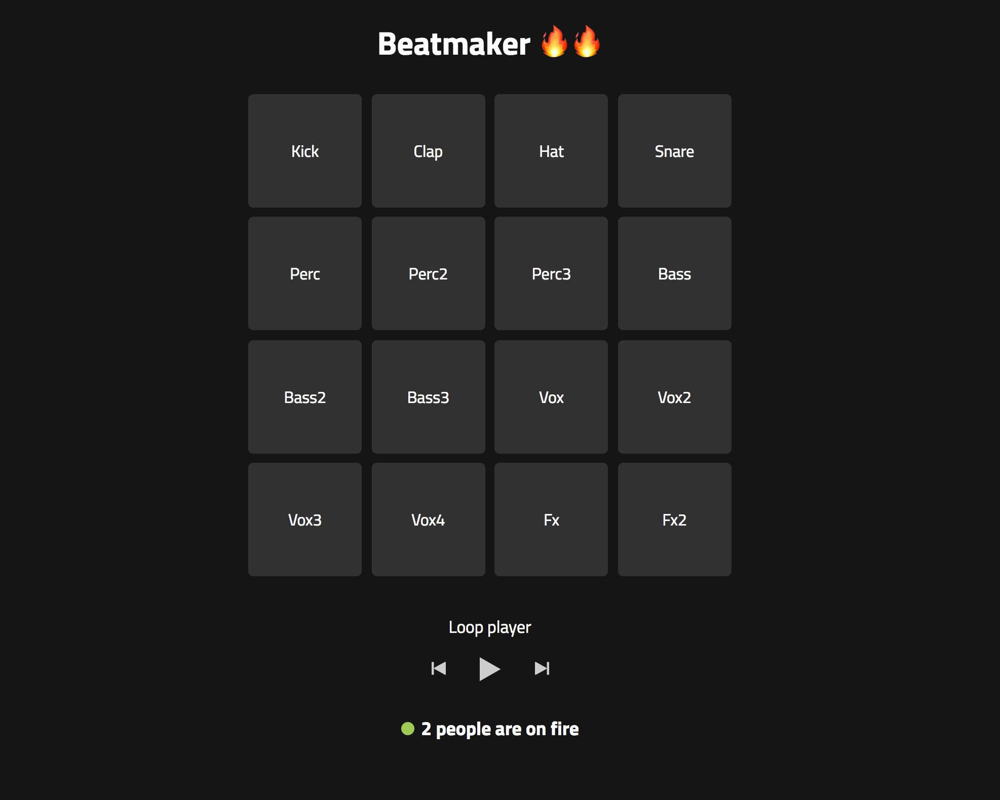

# Real-time beatmaker



This week I've upgraded my existing beatmaker application to a real time application where you can make beats together. I also converted it from a clientside application to serverside working with `Node.js` and `Express`. The real time side works by using sockets with `socket.io`.

[Link to demo](https://real-time-beatmaker.herokuapp.com/)

## Getting started

1.  Clone the repo `git clone`.
2.  Install dependencies `npm install`.
3.  Run `npm start` to start server on port 3000.

## Features
- Play sounds with your mouse or keyboard.
- Play your own sound on every connected client.
- See which sound are made by yourself and by someone else.
- See how many people are connected.
- Play a background loop sound.

## Schedule
In the first week of the `Real Time Web Course` I want to make an application which is real-time and works together with client and serverside. In the proces of building this I want to learn more about `Node.js` and `Express`. Also get more familiar with using web sockets by using `socket.io`.

The following weeks I'm going to build a node web application which consumes an external data source through an API and serves a frontend using routing and templating techniques. This application needs to be a live web app which reflects changes to the back-end and front-end views, by using real-time technologies with web sockets. For this application I'm going to apply the used techniques from the first week.


## Node.js & Express

To get my project running I've started with `npm init` to initialize a `package.json`. From there I started to set-up a `Node.js` directory structure and starting to add different dependencies like `Express` for static file serving and templating. When this was finished I've imported the older `beatmaker` project. This was only a clientside application which I converted to work in node.

## Socket.io
For this real time application I used `socket.io` to communicate between the server and clientside. This happens when a user clicks on a sound. The data(source and name) of that sound is emitted to the server. Where `instruments[j]` is the clicked sound.

```javascript
//client
socket.emit('playsound', instruments[j]);
```

If the server recieves the emit he broadcast it to all other clients execpt the sender with:
```javascript
//server
socket.on('playsound', function(sound) {
	socket.broadcast.emit('playsound', sound);
});
```
Lastly the client of all connected users are going to hear the clicked sound of the sender by executing this function:

```javascript
//client
socket.on('playsound', function(sound) {
	var audio = new Audio(sound.src);
	audio.play();
});
```

## Deployment

I've deployed my application by using `Heroku`. This was pretty easy to setup. Steps that I took:

1.  Created an `Heroku` account.
2.  Added a new application.
3.  Chose `GitHub` as deployment method.
4.  Connected heroku to the `git repo` .
5.  App was running on [https://real-time-beatmaker.herokuapp.com/](https://real-time-beatmaker.herokuapp.com/)

The only thing I changed to get the app working was changing this line in my `app.js`

from:

```javascript
http.listen(3000, function() {
    console.log('server is running on port 3000');
});
```

to:
```javascript
http.listen(process.env.PORT || 3000, function() {
    console.log('server is running on port 3000');
});
```

This because Heroku assigns the port for you, so you can't set your own. You need to have read in the port number from the PORT environment variable. In this case it would be the `process.env.PORT` variable.

[Source](https://stackoverflow.com/questions/43944929/how-to-listen-on-any-port-on-heroku-when-a-web-port-80-is-already-in-use)

## Built With

- [Node.js](https://nodejs.org/en/) -  Server framework
- [Express](https://expressjs.com/) -  Static file serving/templating
- [EJS](http://ejs.co/) - Templating language
- [socket.io](https://socket.io/) -  Real-time engine
- [Web audio API](https://developer.mozilla.org/en-US/docs/Web/API/Web_Audio_API) -  Controlling audio


## License

MIT © Yoeri Pasmans
